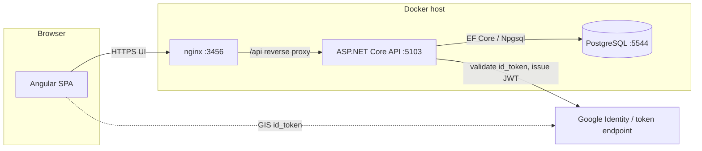

# System architecture (container view)

This document is a **C4-style container diagram** for reviewers and interviewers: who talks to whom, and on which ports (Docker defaults).

## Container diagram

## Request path (typical)

1. User opens the SPA through **nginx** (`http://localhost:3456`).
2. Authenticated REST calls go to **`/api/v1/...`** on the same origin; nginx forwards them to the **API** container.
3. The API uses **JWT bearer** for app auth and **Google’s libraries** for Google sign-in validation on `POST /auth/google`.

## Performance notes (intentional shapes)

- **List endpoints** that return nested DTOs (e.g. teacher bookings) use **explicit EF `Include` / `ThenInclude`** to avoid **N+1** queries when projecting to records.
- **Catalog and booking writes** stay in scoped services (`BookingService`, `SlotGenerator`, …) so controllers remain thin and testable.

## Related material

- [ADR index](adr/README.md) — trade-offs for tests, bookings, and HTTP observability.
- [API reference](api-reference.md) — route list including **`GET /health`**.
